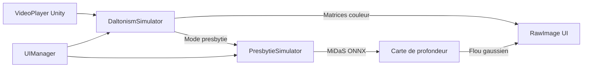

# Eye Conditions and Diseases — Simulateur de troubles visuels

> **En bref** : une application Unity qui lit une vidéo et vous montre *à quoi pourrait ressembler* la même scène pour une personne atteinte de daltonisme, de neige visuelle ou de presbytie. Vous changez de mode via des boutons — la vidéo se transforme en temps réel.

Application **Unity 6** de simulation immersive des principaux troubles de la vision. Le projet permet d’observer une scène vidéo en temps réel tout en appliquant des filtres qui reproduisent différentes affections oculaires.

Développé dans le cadre d’un **projet de session** — cours **Technologies immersives** (UQTR).

**Dépôt** : [github.com/Adamandiaye444/Simulation-Presbytie](https://github.com/Adamandiaye444/Simulation-Presbytie)

---

## À quoi sert ce projet ?

| Question | Réponse |
|----------|---------|
| **Pour qui ?** | Étudiants, enseignants, développeurs curieux de la vision humaine |
| **Contexte** | Projet de session — Technologies immersives (UQTR) |
| **Objectif** | Sensibiliser aux troubles visuels en *voyant* leur effet sur une même scène |
| **Comment ?** | Une vidéo de démonstration + une interface pour basculer entre les modes |
| **Ce n’est pas…** | Un outil médical de diagnostic — uniquement une approximation pédagogique |

---

## Aperçu de l’application

L’interface se compose de trois zones :

```
┌─────────────────────────────────────────────────────────┐
│  [Normal] [Protanopie] [Deutéranopie] [Tritanopie]      │
│  [Visual Snow] [Presbytie] [Réinitialiser]              │
│  Menu déroulant ▼                                       │
├─────────────────────────────────────────────────────────┤
│                                                         │
│              Vidéo avec filtre appliqué                 │
│                  (zone centrale)                        │
│                                                         │
├─────────────────────────────────────────────────────────┤
│  Description du mode sélectionné (texte explicatif)     │
└─────────────────────────────────────────────────────────┘
```

**Utilisation typique :**
1. Lancer la scène et appuyer sur **Play**
2. Cliquer sur un mode (ex. *Deutéranopie*) → la vidéo change instantanément
3. Lire la description en bas pour comprendre le trouble simulé
4. Revenir à **Normal** ou **Réinitialiser** pour comparer

> **Captures d’écran** : placez vos images dans `docs/screenshots/` (ex. `normal.png`, `protanopie.png`) pour documenter visuellement chaque mode.

---

## Modes de simulation

### Par catégorie de trouble

| Catégorie | Modes concernés | Nature du trouble |
|-----------|-----------------|-------------------|
| **Référence** | Normal | Aucune altération |
| **Daltonisme** | Protanopie, Deutéranopie, Tritanopie | Difficulté à percevoir certaines couleurs (congénital) |
| **Neurologique** | Visual Snow Syndrome | Bruit visuel permanent (« neige » sur l’écran) |
| **Lié à l’âge** | Presbytie | Difficulté à voir nettement de près |

> Seuls les modes **1, 2 et 3** sont des formes de daltonisme. **Visual Snow** et **Presbytie** sont d’autres types de troubles visuels.

### Détail de chaque mode

| Mode | Type | Description |
|------|------|-------------|
| **Normal** | Référence | Vision classique, sans altération |
| **Protanopie** | Daltonisme | Ne perçoit pas le rouge ; rouges → brun/vert foncé |
| **Deutéranopie** | Daltonisme | Ne perçoit pas le vert ; confusion verts/rouges/oranges |
| **Tritanopie** | Daltonisme | Difficulté bleu/vert et jaune/violet (rare) |
| **Visual Snow Syndrome** | Neurologique | Bruit visuel permanent, comme un écran TV non réglé |
| **Presbytie** | Âge | Flou sur les objets proches (simulé via profondeur MiDaS) |

L’interface propose des **boutons**, un **menu déroulant** et une **zone de description** qui s’adapte au mode sélectionné.

**Note :** la presbytie peut aussi être activée/désactivée via le **bouton Presbytie** indépendamment du menu déroulant.

---

## Technologies utilisées

| Composant | Rôle |
|-----------|------|
| **Unity 6** (`6000.2.0b2`) + URP | Moteur et rendu |
| **OpenCV for Unity** | Traitement d’image, matrices couleur, réseau neuronal |
| **VideoPlayer** (Unity) | Lecture vidéo native |
| **MiDaS** (`midas.onnx`) | Estimation de profondeur pour la presbytie |
| Matrices daltonisme | Basées sur [BCGSC Color Blindness Simulator](https://mk.bcgsc.ca/colorblind/math.mhtml) |

---

## Prérequis

- [Unity Hub](https://unity.com/download) avec l’éditeur **6000.2.0b2** (ou version compatible Unity 6)
- **[Git LFS](https://git-lfs.github.com/)** — obligatoire pour télécharger `midas.onnx` (~400 Mo)
- Environ **2 Go d’espace disque**

> ⚠️ **OpenCV for Unity est obligatoire**
>
> Ce package **n’est pas inclus** dans le dépôt (licence Asset Store, payant). **Sans lui, le projet ne compile pas** — vous verrez des erreurs sur `OpenCVForUnity.*` dans les scripts. Voir [étape 3 de l’installation](#3-installer-opencv-for-unity-obligatoire).

---

## Installation

### 1. Cloner le dépôt

Installez Git LFS **avant** de cloner (`brew install git-lfs` puis `git lfs install`).

**SSH (recommandé)**

```bash
git lfs install
git clone git@github.com:Adamandiaye444/Simulation-Presbytie.git
cd Simulation-Presbytie
```

**HTTPS**

```bash
git lfs install
git clone https://github.com/Adamandiaye444/Simulation-Presbytie.git
cd Simulation-Presbytie
```

Vérifier que le modèle est bien téléchargé (doit faire ~398 Mo, pas quelques octets) :

```bash
ls -lh Assets/Modele/midas.onnx
```

### 2. Ouvrir le projet dans Unity

1. Ouvrir **Unity Hub** → **Add** → sélectionner le dossier du projet
2. Choisir l’éditeur **Unity 6000.2.0b2** (recommandé)
3. Attendre la fin de l’importation des assets

### 3. Installer OpenCV for Unity (obligatoire)

Le dossier `Assets/OpenCVForUnity` est **exclu du dépôt**.

1. Acquérir [OpenCV for Unity](https://assetstore.unity.com/packages/tools/integration/opencv-for-unity-21088) sur l’Asset Store Unity
2. Dans Unity : **Window → Package Manager → My Assets** → importer le package
3. Vérifier que `Assets/StreamingAssets/OpenCVForUnity/video.mp4` existe (fourni dans ce dépôt)

### 4. Vérifier le modèle de profondeur

Le fichier `Assets/Modele/midas.onnx` doit être présent (~398 Mo). Sans lui, le mode **Presbytie** ne fonctionnera pas.

---

## Lancement

1. Ouvrir la scène `Assets/Scenes/SampleScene.unity`
2. Appuyer sur **Play** ▶ dans l’éditeur Unity
3. Cliquer sur les boutons ou utiliser le menu déroulant pour changer de mode
4. Observer la vidéo et lire la description en bas de l’écran

---

## Dépannage

| Problème | Cause probable | Solution |
|----------|----------------|----------|
| Erreurs `OpenCVForUnity` à la compilation | Package non installé | Importer OpenCV for Unity (étape 3) |
| `midas.onnx` très petit (~130 octets) | Git LFS non utilisé au clone | `git lfs install` puis `git lfs pull` |
| `Échec de chargement du modèle ONNX` | Fichier absent ou corrompu | Vérifier `Assets/Modele/midas.onnx` (~398 Mo) |
| `Impossible d'ouvrir la vidéo` | Vidéo manquante | Vérifier `Assets/StreamingAssets/OpenCVForUnity/video.mp4` |
| Écran noir au Play | Scène ou composants mal liés | Ouvrir `SampleScene.unity`, vérifier la Console Unity |
| Mode Presbytie sans effet | Carte de profondeur pas prête | Attendre quelques secondes au premier lancement |
| Unity version incompatible | Mauvaise version éditeur | Installer Unity **6000.2.0b2** via Unity Hub |

---

## Structure du projet

```
Assets/
├── Scenes/
│   └── SampleScene.unity      # Scène principale — ouvrir celle-ci
├── Scripts/
│   ├── DaltonismSimulator.cs  # Filtres daltonisme + neige visuelle
│   ├── PresbytieSimulator.cs  # Profondeur MiDaS + flou presbytie
│   └── UIManager.cs           # Boutons, dropdown, descriptions
├── Modele/
│   └── midas.onnx             # Modèle MiDaS (Git LFS, ~398 Mo)
├── StreamingAssets/
│   └── OpenCVForUnity/
│       └── video.mp4          # Vidéo de démonstration
└── OpenCVForUnity/            # À installer via Asset Store (gitignored)
docs/
└── screenshots/               # Captures d’écran (optionnel)
```

---

## Architecture (développeurs)



**En langage simple :** la vidéo passe dans un filtre (couleurs ou flou), le résultat s’affiche à l’écran, et l’interface choisit quel filtre appliquer.

### Scripts principaux

| Script | Rôle |
|--------|------|
| `DaltonismSimulator.cs` | Lit la vidéo, applique daltonisme / neige visuelle, affiche le résultat |
| `PresbytieSimulator.cs` | Calcule la profondeur (MiDaS), floute les objets proches |
| `UIManager.cs` | Relie boutons et menu aux simulateurs, met à jour les descriptions |

### Référence code (index des modes)

| Index | Mode | Effet technique |
|-------|------|-----------------|
| 0 | Normal | Aucune transformation |
| 1 | Protanopie | Matrice 3×3 rouge-déficient |
| 2 | Deutéranopie | Matrice 3×3 vert-déficient |
| 3 | Tritanopie | Matrice 3×3 bleu-déficient |
| 4 | Visual Snow | Bruit gaussien superposé |
| 5 | Presbytie | Flou basé sur profondeur MiDaS |

---

## Avertissement

Ce projet est un **outil pédagogique de simulation**. Il ne remplace pas un diagnostic médical et ne reflète qu’une approximation visuelle des troubles décrits. Les perceptions réelles varient selon les individus.

---

## Licence et crédits

- Projet de session — **UQTR**, Technologies immersives (2025)
- OpenCV for Unity — licence Asset Store (à acquérir séparément)
- MiDaS — modèle de profondeur monoculaire
- Référence daltonisme : [BCGSC Color Blindness Simulator](https://mk.bcgsc.ca/colorblind/)
