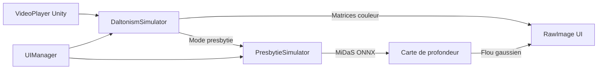

# Eye Conditions and Diseases — Simulateur de troubles visuels

Application **Unity 6** de simulation immersive des principaux troubles de la vision. Le projet permet d’observer une scène vidéo en temps réel tout en appliquant des filtres qui reproduisent différentes affections oculaires : daltonisme, syndrome de neige visuelle (Visual Snow) et presbytie.

Développé dans le cadre du cours **Technologies immersives** (UQTR).

---

## Fonctionnalités

| Mode | Description |
|------|-------------|
| **Normal** | Vision de référence, sans altération |
| **Protanopie** | Absence de perception du rouge ; les rouges apparaissent brun/vert foncé |
| **Deutéranopie** | Absence de perception du vert ; confusion entre verts, rouges et oranges |
| **Tritanopie** | Difficulté à distinguer bleu/vert et jaune/violet (forme rare) |
| **Visual Snow Syndrome** | Bruit visuel permanent (effet « neige » sur l’écran) |
| **Presbytie** | Flou progressif sur les objets proches, simulé via une carte de profondeur |

L’interface propose des **boutons**, un **menu déroulant** et une **zone de description** qui s’adapte au mode sélectionné.

---

## Technologies utilisées

- **Unity 6** (`6000.2.0b2`) avec **Universal Render Pipeline (URP)**
- **OpenCV for Unity** — traitement d’image, matrices de transformation couleur, réseau de neurones
- **VideoPlayer** (Unity) — lecture vidéo native
- **MiDaS** (`midas.onnx`) — estimation de profondeur pour la simulation de presbytie
- Matrices de daltonisme basées sur [mk.bcgsc.ca/colorblind](https://mk.bcgsc.ca/colorblind/math.mhtml)

---

## Prérequis

- [Unity Hub](https://unity.com/download) avec l’éditeur **6000.2.0b2** (ou version compatible Unity 6)
- Package **OpenCV for Unity** (Asset Store) — non versionné dans ce dépôt (voir installation ci-dessous)
- Environ **2 Go d’espace disque** (modèle ONNX ~400 Mo inclus)
- **[Git LFS](https://git-lfs.github.com/)** — requis pour télécharger `midas.onnx` (> 100 Mo, hébergé via LFS sur GitHub)

---

## Installation

### 1. Cloner le dépôt

Installez Git LFS une fois (`brew install git-lfs` puis `git lfs install`), puis clonez :

**SSH (recommandé)**

```bash
git lfs install
git clone git@github.com:Adamandiaye444/Simulation-Presbytie.git
cd Simulation-Presbytie
```

**HTTPS**

```bash
git clone https://github.com/Adamandiaye444/Simulation-Presbytie.git
cd Simulation-Presbytie
```

### 2. Ouvrir le projet dans Unity

1. Ouvrir **Unity Hub** → **Add** → sélectionner le dossier du projet
2. Utiliser l’éditeur **Unity 6000.2.0b2** (recommandé)

### 3. Installer OpenCV for Unity

Le dossier `Assets/OpenCVForUnity` est exclu du dépôt (licence Asset Store). Après import :

1. Acquérir [OpenCV for Unity](https://assetstore.unity.com/packages/tools/integration/opencv-for-unity-21088) sur l’Asset Store
2. Importer le package dans le projet
3. Vérifier que le chemin `Assets/StreamingAssets/OpenCVForUnity/video.mp4` existe (fourni dans ce dépôt)

### 4. Vérifier le modèle de profondeur

Le fichier `Assets/Modele/midas.onnx` doit être présent (~398 Mo). Il est utilisé par `PresbytieSimulator` pour générer la carte de profondeur.

---

## Lancement

1. Ouvrir la scène `Assets/Scenes/SampleScene.unity`
2. Appuyer sur **Play** dans l’éditeur Unity
3. Utiliser l’interface pour changer de mode de simulation

---

## Structure du projet

```
Assets/
├── Scenes/
│   └── SampleScene.unity      # Scène principale
├── Scripts/
│   ├── DaltonismSimulator.cs  # Filtres daltonisme + neige visuelle
│   ├── PresbytieSimulator.cs  # Profondeur MiDaS + flou presbytie
│   └── UIManager.cs           # Boutons, dropdown, descriptions
├── Modele/
│   └── midas.onnx             # Modèle MiDaS (estimation de profondeur)
├── StreamingAssets/
│   └── OpenCVForUnity/
│       └── video.mp4          # Vidéo de démonstration
└── OpenCVForUnity/            # À installer via Asset Store (gitignored)
```

---

## Architecture



### Scripts principaux

- **`DaltonismSimulator`** — Lit la vidéo via `VideoPlayer`, convertit chaque frame en `Mat` OpenCV, applique la matrice de transformation selon le mode, puis affiche le résultat sur un `RawImage`.
- **`PresbytieSimulator`** — Charge `midas.onnx`, infère une carte de profondeur et fusionne une image nette (objets lointains) avec une image floutée (objets proches) pour simuler la difficulté de mise au point de près.
- **`UIManager`** — Relie les contrôles UI aux simulateurs et met à jour les textes explicatifs.

---

## Modes de simulation (référence code)

| Index | Constante | Effet |
|-------|-----------|-------|
| 0 | Normal | Aucune transformation |
| 1 | Protanopie | Matrice 3×3 rouge-déficient |
| 2 | Deutéranopie | Matrice 3×3 vert-déficient |
| 3 | Tritanopie | Matrice 3×3 bleu-déficient |
| 4 | Visual Snow | Bruit gaussien superposé |
| 5 | Presbytie | Flou basé sur profondeur MiDaS |

---

## Dépôt GitHub

- **Dépôt** : [github.com/Adamandiaye444/Simulation-Presbytie](https://github.com/Adamandiaye444/Simulation-Presbytie)

```bash
git remote add origin git@github.com:Adamandiaye444/Simulation-Presbytie.git
git branch -M main
git push -u origin main
```

---

## Avertissement

Ce projet est un **outil pédagogique de simulation**. Il ne remplace pas un diagnostic médical et ne reflète qu’une approximation visuelle des troubles décrits. Les perceptions réelles varient selon les individus.

---

## Licence et crédits

- Projet académique — **UQTR**, Technologies immersives (2025)
- OpenCV for Unity — licence Asset Store (à acquérir séparément)
- MiDaS — modèle de profondeur monocular
- Référence daltonisme : [BCGSC Color Blindness Simulator](https://mk.bcgsc.ca/colorblind/)
